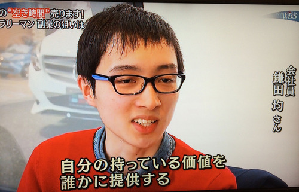
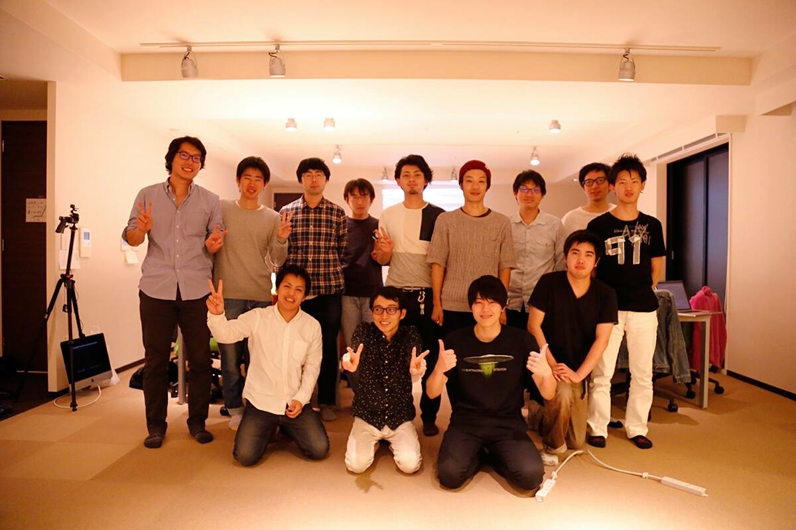

# 職務経歴書

## 基本情報

|Key|Value|
|---|---|
|氏名|鎌田 均（Hitoshi KAMADA）|
|生年月日|1992/02/26|
|居住地|千葉県|
|最終学歴|愛知工業大学 情報科学部 情報科学科 メディア情報専攻|

## 各種アカウント

- [note](https://note.com/kmd_htsh/)
- [GitHub](https://github.com/hiesiea)
- [Qiita](https://qiita.com/hiesiea)
- [Twitter](https://twitter.com/kmd_htsh0226)
- [Speaker Deck](https://speakerdeck.com/kmd_htsh0226)
- [Zenn](https://zenn.dev/kmd_htsh0226)

## スキルセット

### 強み

- Kotlin, Java, Flutter による Android アプリ開発および設計
- レガシーコードからモダンな Android アプリへのリファクタリングおよびリプレイス
- アジャイル、スクラムによるチーム開発
- Android アプリ開発におけるテックリード
- プログラミング講師経験あり（Java, Android）

### 主な使用可能言語

- Kotlin
- Java
- Dart
- C#

### 主な使用可能フレームワーク・ライブラリ等

- Android Jetpack
  - Jetpack Compose
    - Coil
    - Accompanist
  - Navigation
  - Room
  - Hilt
  - WorkManager
- RxJava 3
- Kotlin Coroutines
- Kotlin Flow
- Flutter
- OkHttp 3
- Retrofit 2
- Moshi
- Glide
- JUnit
- Mockito

## 職務経歴詳細

### 職務経歴概要

|期間|概要|
|---|---|
|2014/04 ~ 2015/08|株式会社ケイ・アイ・テック|
|2015/10 ~ 2019/03|株式会社ASCOM|
|2019/03 ~ 現在|フリーランス|

### スキルシート

[スキルシート(鎌田均)_20230131.xlsx](スキルシート(鎌田均)_20230131.xlsx)を参照してください。

## その他実績

### 学生時代

- 電子情報通信学会総合大会 ISS 特別企画「学生ポスターセッション」発表
  - 鎌田均、 丸橋駿平、 澤野弘明： “指差し動作を利用したカーナビのための助手席ユーザの経路指示方法の一調査”, 電子情報通信学会総合大会 ISS 特別企画「学生ポスターセッション」, ISS-SP-317, 1 page (2013-3)

### 業務外活動

- ワールドビジネスサテライト 2015 年 1 月 22 日出演
  - [TimeTicket](https://www.timeticket.jp/)というサービスにて、プログラミング関連の相談に乗っていました
  - [TimeTicket Hacks — テレビ東京「ワールドビジネスサテライト」で紹介されました！](https://blog.timeticket.jp/post/108879706835/%E3%83%86%E3%83%AC%E3%83%93%E6%9D%B1%E4%BA%AC%E3%83%AF%E3%83%BC%E3%83%AB%E3%83%89%E3%83%93%E3%82%B8%E3%83%8D%E3%82%B9%E3%82%B5%E3%83%86%E3%83%A9%E3%82%A4%E3%83%88%E3%81%A7%E7%B4%B9%E4%BB%8B%E3%81%95%E3%82%8C%E3%81%BE%E3%81%97%E3%81%9F)

- スパルタキャンプ Java/Android 編 講師（2015 年 10 月、2016 年 3 月）
  - 3、4 日間かけて Android アプリの開発を学べるプログラミング教室です

- 妖怪笑い袋（スマートスピーカーアプリ）の開発およびリリース
  - 全てのキーワードに対して、ランダムに笑い声を返すだけのスキルです
  - リリース初月で利用者数 100 人突破
    - [Google アシスタント版](https://assistant.google.com/services/a/uid/0000002f26a76e99?hl=ja)
      - [動画](https://www.youtube.com/watch?v=N-AQ-Q36Ts0)
    - Alexa 版 **※公開停止**
      - [動画](https://www.youtube.com/watch?v=2d-1DX_Zojc)
- [かんたん食事管理（iOS アプリ）](https://apps.apple.com/jp/app/%E3%81%8B%E3%82%93%E3%81%9F%E3%82%93%E9%A3%9F%E4%BA%8B%E7%AE%A1%E7%90%86/id1482117628)の開発およびリリース **※公開停止**
  - その日に食べた食事の画像とテキスト情報を入力して一覧表示してくれるアプリです
- 技術発信
  - 主に Qiita, Zenn にて実務等で得られた技術的知見を発信しています
- OSS 活動
  - [DroidKaigi 2021 official app](https://github.com/DroidKaigi/conference-app-2021) コントリビューター
  - [DroidKaigi 2022 official app](https://github.com/DroidKaigi/conference-app-2022) コントリビューター

## 今後の展望

- 新しいことが好きなので、Android アプリだけでなく、チャンスがあれば他分野の開発にも携わりたいです
- テックリードとしての経験をもっと積んでいき、技術にも携わりつつマネジメントもできる人材を目指したいです
- 日常会話程度以上の英語力を身に付けたいです

## 希望条件

- 可能であればフルリモートワークでの勤務を希望します、週 1 回程度の出社であれば可能です
- 言われたとおりにただ作るのではなく、機能要件に対しても一緒に考えたり、提案を受け入れてくれるチームだと良いです
- 新しい挑戦に積極的に取り組める環境が好きです
